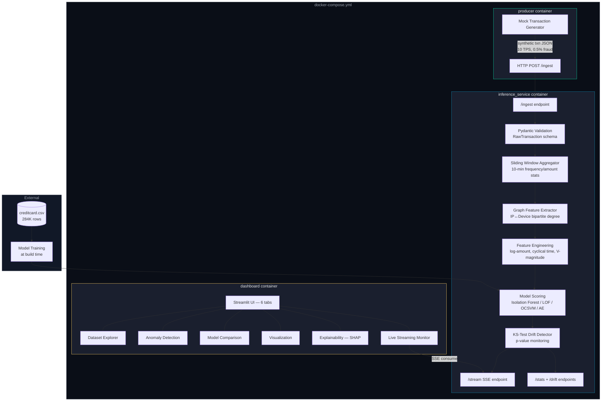

# System Architecture

## Mermaid Diagram



## Data Flow

```
Producer → HTTP POST → /ingest → Pydantic Validation → Sliding Window → Graph Features
    → Feature Engineering → Model Scoring → KS Drift Check → SSE Buffer → Dashboard
```

## Component Details

| Component | Technology | Port | Purpose |
|-----------|-----------|------|---------|
| **Producer** | Python thread / standalone | — | Synthetic transaction generation at configurable TPS |
| **Inference Service** | FastAPI + uvicorn | 8000 | Validation, feature enrichment, scoring, drift detection |
| **Dashboard** | Streamlit | 8501 | 6-tab UI with live streaming monitor |

## Feature Pipeline

| Stage | Features Added |
|-------|---------------|
| **Raw** | Time, V1-V28, Amount |
| **Engineered** | amount_log, amount_zscore, hour_sin, hour_cos, v_magnitude, v_outlier_count |
| **Sliding Window** | txn_count_10m, txn_amount_mean_10m, txn_amount_std_10m, txn_velocity_per_min |
| **Graph** | ip_degree, device_degree, shared_infra_score |

## Concept Drift Detection

- **Method**: Two-sample Kolmogorov-Smirnov test
- **Reference**: First 500 anomaly scores after warm-up
- **Window**: Rolling 500 observations
- **Threshold**: p < 0.01 triggers drift alert
- **Action**: Logged + surfaced in dashboard metrics + `/drift` API endpoint
