# Financial Transaction Fraud Detection Platform


**[Live Demo](https://anomaly-detection-analysis.streamlit.app/)** · https://anomaly-detection-analysis.streamlit.app/

---

## Why This Exists

Most fraud detection tutorials stop at model training — fit an Isolation Forest, plot an ROC curve, done. Real fraud systems need streaming ingestion, real-time feature engineering, concept drift monitoring, analyst feedback loops, and explainable decisions. This project builds the full production pipeline end-to-end: from raw transaction to scored alert to analyst investigation.

---

## Architecture

```mermaid
flowchart TB
    subgraph Docker["docker-compose.yml"]

        subgraph Producer["producer container"]
            PG[Mock Transaction Generator]
            PG -->|"synthetic txn JSON<br/>10 TPS, 0.5% fraud"| POST[HTTP POST /ingest]
        end

        subgraph Inference["inference_service container"]
            direction TB
            INGEST["/ingest endpoint"]
            VAL[Pydantic Validation<br/>RawTransaction schema]
            SW[Sliding Window Aggregator<br/>10-min frequency/amount stats]
            GF[Graph Feature Extractor<br/>IP-Device bipartite degree]
            FE[Feature Engineering<br/>log-amount, cyclical time, V-magnitude]
            MODEL[Model Scoring<br/>Isolation Forest / LOF / OCSVM / AE]
            DRIFT[KS-Test Drift Detector<br/>p-value monitoring]
            RISK[Risk Scoring<br/>model 60% + graph 25% + velocity 15%]
            SSE["/stream SSE endpoint"]
            FB["/feedback + /retrain endpoints"]

            INGEST --> VAL --> SW --> GF --> FE --> MODEL --> DRIFT --> RISK --> SSE
            FB -.->|analyst labels| MODEL
        end

        subgraph Dashboard["dashboard container"]
            direction TB
            ST[Streamlit UI - 5 tabs]
            T4[Live Operations Center]
            ST --- T4
            T4 -->|"SSE consume"| SSE
        end

        POST --> INGEST
    end

    style Producer fill:#111622,stroke:#6366f1,color:#f1f5f9
    style Inference fill:#111622,stroke:#3b82f6,color:#f1f5f9
    style Dashboard fill:#111622,stroke:#f59e0b,color:#f1f5f9
```



## Features

### Streaming Infrastructure
- **Producer/Consumer Pipeline**: Mock transaction generator streams data via Python queue (in-process) or HTTP POST (Docker)
- **Configurable TPS**: Adjustable transactions-per-second and fraud injection rate from the dashboard

### Feature Engineering (13 features across 3 domains)
- **Static Features** (6): Log-scaled amounts, cyclical time encoding, Z-scores, PCA magnitude, outlier counts
- **Sliding Window Features** (4): Per-device transaction count, mean/std amount, and velocity over a 10-minute window
- **Graph-Based Features** (3): IP degree, device degree, and shared infrastructure score from a bipartite IP-Device graph for fraud ring detection

### Statistical Guardrails
- **KS-Test Concept Drift Detection**: Two-sample Kolmogorov-Smirnov test compares live anomaly score distribution against a reference window (p < 0.01 triggers alert)
- **Feature Drift Tracking**: Per-feature mean/std monitoring against training baselines

### ML Models
- **4 Anomaly Detection Models**: Isolation Forest, Local Outlier Factor, One-Class SVM, Autoencoder (scikit-learn + optional PyTorch)
- **SHAP Explainability**: Tree and kernel SHAP explanations for individual fraud predictions
- **Model Comparison**: Leaderboard with ROC/PR curves and metric bars

### Risk Scoring
- **Composite Risk**: Weighted combination of model score (60%), graph features (25%), and velocity signals (15%)
- **Entity Risk Graph**: Heterogeneous graph (card, merchant, device, IP, location) with BFS risk propagation for fraud ring detection
- **Configurable Thresholds**: Tunable risk levels (low/medium/high/critical) via API

### Analyst Feedback Loop
- **Investigation Console**: Review flagged transactions with score breakdowns and feature explanations
- **Feedback Store**: Append-only JSONL records of analyst decisions (fraud/legitimate)
- **Feedback-Informed Retraining**: Retrain models incorporating analyst labels, with automatic versioning

### Data Validation
- **Pydantic v2 Schemas**: Robust validation handles missing fields, NaN strings, negative amounts, out-of-range PCA components
- **Amount clamping** ($50K ceiling), **PCA clamping** ([-100, 100]), and **string sanitization**

### Dashboard (5 Tabs)
1. **Analysis** -- Dataset overview, feature distributions, correlation heatmap, PCA projection, anomaly score distribution, transaction timeline
2. **Detection** -- Model selection, threshold tuning, confusion matrix, flagged transactions, model comparison leaderboard, ROC/PR curves
3. **Explainability** -- SHAP global feature importance + individual transaction explanations
4. **Live Operations** -- Real-time streaming monitor with drift detection, fraud investigation console with analyst feedback, entity risk graph visualization
5. **Monitoring** -- Transaction volume trends, anomaly rate tracking, feature drift, model version history, one-click retraining

## Screenshots

<!-- Screenshots of the dashboard. Replace these placeholders with actual images. -->

| View | Description |
|------|-------------|
|  | Dataset overview with class distribution, PCA projection, and anomaly score landscape |
|  | Threshold tuning with live confusion matrix, model comparison leaderboard, and ROC/PR curves |
|  | SHAP feature importance and per-transaction fraud explanations |
|  | Real-time streaming monitor with drift detection and entity risk graph |
|  | Production metrics, feature drift tracking, and model version history |

*To generate screenshots: run the dashboard locally and capture each tab.*

## Dataset

Uses a **10,000-row stratified sample** from the [Credit Card Fraud Detection dataset](https://www.kaggle.com/datasets/mlg-ulb/creditcardfraud) (Kaggle). Features V1-V28 are PCA-transformed, plus Time and Amount. Class label: 0 = normal, 1 = fraud (~0.17% fraud rate).

## Model Performance

| Model | Precision | Recall | F1 | ROC-AUC | Avg Precision |
|-------|-----------|--------|----|---------|---------------|
| **Local Outlier Factor** | **0.965** | 0.837 | **0.896** | 0.965 | **0.898** |
| One-Class SVM | 0.798 | 0.806 | 0.802 | **0.968** | 0.793 |
| Autoencoder | 0.678 | **0.837** | 0.749 | 0.951 | 0.758 |
| Isolation Forest | 0.577 | 0.806 | 0.672 | 0.963 | 0.698 |

*Evaluated on 2,000-sample test set (98 fraud cases). Threshold optimized per model via F1-maximizing PR curve analysis. All models trained on normal transactions only (unsupervised paradigm).*

## Key Findings

- **LOF dominates on precision**: 96.5% of its fraud flags are correct, producing far fewer false alarms than any other model. This matters in production where each false alert costs analyst time.
- **All models achieve >0.95 AUC**: The PCA-transformed features provide strong separability. The gap between models lies in precision-recall tradeoff, not ranking ability.
- **Isolation Forest over-flags**: High recall (80.6%) but low precision (57.7%) -- it catches most fraud but generates nearly as many false positives as true positives. Useful as a first-pass filter, not a standalone detector.
- **Graph features surface fraud rings**: Shared infrastructure scores (IP + device reuse) identify coordinated fraud that individual transaction features miss. Entities with >3 shared connections correlate strongly with fraud clusters.
- **Drift detection catches distribution shift**: KS-test alerts trigger reliably when fraud injection rate changes, enabling proactive model retraining before performance degrades.

## Quick Start

### Local

```bash
git clone https://github.com/sanjitmathur/distributed-anomaly-rca.git
cd distributed-anomaly-rca
python -m venv venv && source venv/bin/activate  # or venv\Scripts\activate on Windows
pip install -r requirements.txt

# Run the dashboard (trains models on first launch)
streamlit run dashboard/app.py

# Or run the API server
uvicorn api.main:app --reload --port 8000
```

### Docker (Full Streaming Pipeline)

```bash
cd docker
docker-compose up --build
# Dashboard:          http://localhost:8501
# Inference Service:  http://localhost:8000
# Producer starts automatically, streaming at 10 TPS
```

Three containers orchestrated:
| Service | Port | Role |
|---------|------|------|
| `producer` | -- | Generates synthetic transactions, POSTs to inference service |
| `inference_service` | 8000 | Validates, enriches, scores, detects drift, exposes SSE stream |
| `dashboard` | 8501 | Streamlit UI consuming scored results via SSE |

## Feature Pipeline

| Stage | Features |
|-------|----------|
| **Raw** | Time, V1-V28, Amount |
| **Engineered** | amount_log, amount_zscore, hour_sin, hour_cos, v_magnitude, v_outlier_count |
| **Sliding Window** | txn_count_10m, txn_amount_mean_10m, txn_amount_std_10m, txn_velocity_per_min |
| **Graph** | ip_degree, device_degree, shared_infra_score |

## API Endpoints

| Method | Endpoint | Description |
|--------|----------|-------------|
| `GET` | `/health` | Service health + loaded models |
| `POST` | `/score_transaction` | Score single transaction with SHAP explainability |
| `POST` | `/score_batch` | Score multiple transactions with aggregated stats |
| `POST` | `/ingest` | Stream raw transaction through full pipeline |
| `GET` | `/stream` | SSE stream of scored transactions |
| `POST` | `/feedback` | Record analyst fraud/legitimate decision |
| `GET` | `/feedback/stats` | Feedback summary |
| `POST` | `/retrain` | Retrain model with optional feedback incorporation |
| `GET` | `/retrain/history` | Model version history |
| `GET` | `/monitoring` | Metrics (volume, drift, time-series) |
| `GET` | `/drift` | KS-drift detector status |
| `GET` | `/risk/config` | Risk thresholds + weights |
| `PUT` | `/risk/config` | Update risk thresholds |
| `GET` | `/graph/stats` | Entity graph statistics |
| `GET` | `/graph/clusters` | High-risk entity clusters |
| `GET` | `/graph/data` | Full graph for visualization |
| `GET` | `/model_metrics` | Cached evaluation metrics |
| `POST` | `/predict` | Legacy: single transaction score |
| `POST` | `/batch_predict` | Legacy: batch scores |

```bash
# Score a transaction
curl -X POST http://localhost:8000/score_transaction?model=isolation_forest \
  -H "Content-Type: application/json" \
  -d '{"Amount": 149.62, "Time": 0, "V1": -1.36, "V2": -0.07}'

# Ingest through streaming pipeline
curl -X POST http://localhost:8000/ingest \
  -H "Content-Type: application/json" \
  -d '{"transaction_id": "txn-001", "source_ip": "10.0.1.5", "device_id": "DEV-ABC", "Amount": 149.62, "Time": 0, "V1": -1.36, "V2": -0.07}'
```

## Project Structure

```
├── app.py                        # Entry point for Streamlit Cloud
├── ARCHITECTURE.md               # Mermaid system architecture diagram
├── api/
│   ├── main.py                   # FastAPI: 20+ endpoints (scoring, streaming, feedback, risk, graph)
│   └── schemas.py                # Pydantic request/response models
├── streaming/
│   ├── producer.py               # Mock transaction generator (queue + HTTP modes)
│   ├── consumer.py               # Stateful streaming consumer (validate -> enrich -> score -> drift)
│   ├── schemas.py                # Pydantic v2 validation for dirty incoming data
│   ├── feature_store.py          # Sliding window aggregator + graph feature extractor
│   └── drift_detector.py         # KS-test concept drift detection
├── dashboard/
│   └── app.py                    # 5-tab Streamlit dashboard with premium dark theme
├── data/
│   ├── creditcard_sample.csv     # 10K stratified sample
│   └── generate_sample.py        # Sample generation script
├── docker/
│   ├── Dockerfile.base           # Base image (installs deps, trains models at build)
│   └── docker-compose.yml        # 3-service orchestration: producer, inference, dashboard
├── evaluation/
│   ├── metrics.py                # Precision, recall, F1, ROC-AUC, PR curves
│   └── model_comparison.py       # Leaderboard, ROC/PR/bar chart plots
├── models/
│   ├── train_models.py           # Train 4 models, save to registry
│   ├── model_loader.py           # Load trained models from registry
│   ├── retrain.py                # Retraining pipeline with feedback + versioning
│   └── saved/                    # Serialized .joblib models + metadata
├── monitoring/
│   ├── tracker.py                # Time-series metrics, feature drift, model version tracking
│   └── feedback.py               # Append-only JSONL analyst feedback store
├── pipeline/
│   ├── preprocessing.py          # Load, stratified split, scale (train on normal only)
│   └── feature_engineering.py    # 6 static engineered features
├── risk/
│   ├── scoring.py                # Composite risk scorer (model + graph + velocity)
│   └── graph.py                  # Entity risk graph with BFS propagation + cluster detection
├── tests/
│   ├── test_preprocessing.py     # Data loading and splitting tests
│   ├── test_features.py          # Feature engineering tests
│   ├── test_models.py            # Model training and scoring tests
│   └── test_api.py               # FastAPI endpoint tests
├── utils/
│   ├── config.py                 # Central config (paths, hyperparams, feature lists)
│   └── logger.py                 # Structured logging
└── requirements.txt
```

## Tech Stack

| Category | Technology |
|----------|-----------|
| ML Models | scikit-learn (Isolation Forest, LOF, OCSVM), PyTorch (Autoencoder) |
| Streaming | Python queue (in-process), HTTP producer/consumer, SSE |
| Drift Detection | scipy (Kolmogorov-Smirnov test) |
| Feature Store | Sliding window aggregator, bipartite graph extractor |
| Risk Analysis | Entity graph with BFS propagation, composite scoring |
| Validation | Pydantic v2 |
| Explainability | SHAP (TreeExplainer + KernelExplainer) |
| Backend | FastAPI, Uvicorn |
| Frontend | Streamlit, Plotly |
| Data | pandas, NumPy |
| Deployment | Docker Compose (3-service), Streamlit Cloud |

## Running Tests

```bash
pytest tests/ -v
```

## Known Limitations

- No authentication on API endpoints (acceptable for demo; would add JWT/OAuth2 in production)
- No persistent database -- SSE buffer and feedback store are ephemeral in Docker unless volumes are mounted
- Streamlit Cloud has limited compute; first cold-start trains models and takes ~60s
- Autoencoder falls back to sklearn MLPRegressor when PyTorch is unavailable

## License

MIT
