# Financial Transaction Fraud Detection Platform


Production-grade, streaming-ready ML platform that detects fraudulent financial transactions using 4 anomaly detection models, real-time feature engineering (sliding window + graph-based), concept drift detection via KS-tests, and a 6-tab Streamlit dashboard with SHAP explainability.

**[Live Demo](https://anomaly-detection-analysis.streamlit.app/)** · https://anomaly-detection-analysis.streamlit.app/

---

## Architecture

```mermaid
flowchart TB
    subgraph Docker["docker-compose.yml"]

        subgraph Producer["producer container"]
            PG[Mock Transaction Generator]
            PG -->|"synthetic txn JSON<br/>10 TPS, 0.5% fraud"| POST[HTTP POST /ingest]
        end

        subgraph Inference["inference_service container"]
            direction TB
            INGEST["/ingest endpoint"]
            VAL[Pydantic Validation<br/>RawTransaction schema]
            SW[Sliding Window Aggregator<br/>10-min frequency/amount stats]
            GF[Graph Feature Extractor<br/>IP↔Device bipartite degree]
            FE[Feature Engineering<br/>log-amount, cyclical time, V-magnitude]
            MODEL[Model Scoring<br/>Isolation Forest / LOF / OCSVM / AE]
            DRIFT[KS-Test Drift Detector<br/>p-value monitoring]
            SSE["/stream SSE endpoint"]

            INGEST --> VAL --> SW --> GF --> FE --> MODEL --> DRIFT --> SSE
        end

        subgraph Dashboard["dashboard container"]
            direction TB
            ST[Streamlit UI — 6 tabs]
            T6[Live Streaming Monitor]
            ST --- T6
            T6 -->|"SSE consume"| SSE
        end

        POST --> INGEST
    end

    style Producer fill:#1a1f2e,stroke:#06d6a0,color:#e8eaed
    style Inference fill:#1a1f2e,stroke:#118ab2,color:#e8eaed
    style Dashboard fill:#1a1f2e,stroke:#ffd166,color:#e8eaed
```



## Features

### Streaming Infrastructure
- **Producer/Consumer Pipeline**: Mock transaction generator streams data via Python queue (in-process) or HTTP POST (Docker), replacing static CSV upload
- **Configurable TPS**: Adjustable transactions-per-second and fraud injection rate from the dashboard UI

### Feature Engineering
- **Static Features** (6): Log-scaled amounts, cyclical time encoding, Z-scores, PCA magnitude, outlier counts
- **Sliding Window Features** (4): Per-device transaction count, mean/std amount, and velocity over a 10-minute window
- **Graph-Based Features** (3): IP degree, device degree, and shared infrastructure score from a bipartite IP↔Device graph — detects fraud rings sharing IPs/devices

### Statistical Guardrails
- **KS-Test Concept Drift Detection**: Two-sample Kolmogorov-Smirnov test compares live anomaly score distribution against a reference window (p < 0.01 triggers alert)
- **Live Drift Dashboard**: Drift alerts surfaced in real-time on the streaming monitor tab and via `/drift` API endpoint

### ML Models
- **4 Anomaly Detection Models**: Isolation Forest, Local Outlier Factor, One-Class SVM, Autoencoder (scikit-learn + optional PyTorch)
- **SHAP Explainability**: Tree and kernel SHAP explanations for individual fraud predictions
- **Model Comparison**: Leaderboard with ROC/PR curves and metric bar charts

### Data Validation
- **Pydantic v2 Schemas**: Robust validation handles missing fields, NaN strings, negative amounts, out-of-range PCA components, and garbage columns
- **Amount clamping** ($50K ceiling), **PCA clamping** ([-100, 100]), and **string sanitization** (length-capped, stripped)

### Dashboard (6 Tabs)
1. **Dataset Explorer** — Class distribution, feature histograms, correlation heatmap
2. **Anomaly Detection** — Model selection, threshold tuning, confusion matrix, flagged transactions
3. **Model Comparison** — Leaderboard, ROC/PR curves, metric bars
4. **Visualization** — PCA projection, anomaly score distribution, transaction timeline
5. **Explainability** — SHAP feature importance + individual transaction explanations
6. **Live Streaming Monitor** — Real-time scoring with drift indicators, sliding window stats, graph features, fraud alerts

## Dataset

Uses a **10,000-row stratified sample** from the [Credit Card Fraud Detection dataset](https://www.kaggle.com/datasets/mlg-ulb/creditcardfraud) (Kaggle). Features V1-V28 are PCA-transformed, plus Time and Amount. Class label: 0 = normal, 1 = fraud (~0.17% fraud rate).

## Quick Start

### Local

```bash
# Clone and setup
git clone https://github.com/sanjitmathur/distributed-anomaly-rca.git
cd distributed-anomaly-rca
python -m venv venv && source venv/bin/activate  # or venv\Scripts\activate on Windows
pip install -r requirements.txt

# Run the dashboard (trains models on first launch)
streamlit run dashboard/app.py

# Or run the API server
uvicorn api.main:app --reload --port 8000
```

### Docker (Full Streaming Pipeline)

```bash
cd docker
docker-compose up --build
# Dashboard:          http://localhost:8501
# Inference Service:  http://localhost:8000
# Producer starts automatically, streaming at 10 TPS
```

Three containers orchestrated:
| Service | Port | Role |
|---------|------|------|
| `producer` | — | Generates synthetic transactions, POSTs to inference service |
| `inference_service` | 8000 | Validates, enriches, scores, detects drift, exposes SSE stream |
| `dashboard` | 8501 | Streamlit UI consuming scored results via SSE |

## Feature Pipeline

| Stage | Features |
|-------|----------|
| **Raw** | Time, V1-V28, Amount |
| **Engineered** | amount_log, amount_zscore, hour_sin, hour_cos, v_magnitude, v_outlier_count |
| **Sliding Window** | txn_count_10m, txn_amount_mean_10m, txn_amount_std_10m, txn_velocity_per_min |
| **Graph** | ip_degree, device_degree, shared_infra_score |

## Model Performance

| Model | Precision | Recall | F1 | ROC-AUC |
|-------|-----------|--------|----|---------|
| Isolation Forest | — | — | — | — |
| Local Outlier Factor | — | — | — | — |
| One-Class SVM | — | — | — | — |
| Autoencoder | — | — | — | — |

*Metrics populated after first training run on the dashboard.*

## API Endpoints

| Method | Endpoint | Description |
|--------|----------|-------------|
| `GET` | `/health` | Service health + loaded models |
| `POST` | `/predict` | Score a single transaction (stateless) |
| `POST` | `/batch_predict` | Score multiple transactions (stateless) |
| `POST` | `/ingest` | Stream a raw transaction through the full pipeline |
| `GET` | `/stream` | SSE stream of scored transactions for dashboard |
| `GET` | `/stats` | Consumer pipeline statistics |
| `GET` | `/drift` | Concept drift detector status |
| `GET` | `/model_metrics` | Cached evaluation metrics |

```bash
# Score a transaction (stateless)
curl -X POST http://localhost:8000/predict?model=isolation_forest \
  -H "Content-Type: application/json" \
  -d '{"Amount": 149.62, "Time": 0, "V1": -1.36, "V2": -0.07}'

# Ingest through streaming pipeline (with drift + window + graph features)
curl -X POST http://localhost:8000/ingest \
  -H "Content-Type: application/json" \
  -d '{"transaction_id": "txn-001", "source_ip": "10.0.1.5", "device_id": "DEV-ABC", "Amount": 149.62, "Time": 0, "V1": -1.36, "V2": -0.07}'
```

## Project Structure

```
├── app.py                        # Entry point for Streamlit Cloud
├── ARCHITECTURE.md               # Mermaid.js system architecture diagram
├── api/
│   ├── main.py                   # FastAPI: /predict, /ingest, /stream SSE, /drift
│   └── schemas.py                # Pydantic request/response models
├── streaming/
│   ├── producer.py               # Mock transaction generator (queue + HTTP modes)
│   ├── consumer.py               # Core streaming consumer (validate → enrich → score → drift)
│   ├── schemas.py                # Pydantic v2 validation for dirty incoming data
│   ├── feature_store.py          # Sliding window aggregator + graph feature extractor
│   └── drift_detector.py         # KS-test concept drift detection
├── dashboard/
│   └── app.py                    # 6-tab Streamlit dashboard with live streaming monitor
├── data/
│   ├── creditcard_sample.csv     # 10K stratified sample
│   └── generate_sample.py        # Sample generation script
├── docker/
│   ├── Dockerfile.base           # Shared base image (installs deps, trains models)
│   └── docker-compose.yml        # 3-service orchestration: producer, inference, dashboard
├── evaluation/
│   ├── metrics.py                # Precision, recall, F1, ROC-AUC, PR curves
│   └── model_comparison.py       # Leaderboard, ROC/PR/bar chart plots
├── models/
│   ├── model_loader.py           # Load trained models from registry
│   ├── train_models.py           # Train 4 models, save to registry
│   └── saved/                    # Serialized .joblib models + metadata
├── pipeline/
│   ├── preprocessing.py          # Load, split, scale data
│   └── feature_engineering.py    # Static engineered features
├── tests/
│   ├── test_preprocessing.py
│   ├── test_features.py
│   ├── test_models.py
│   └── test_api.py
├── utils/
│   ├── config.py                 # Central config (paths, hyperparams, feature lists)
│   └── logger.py                 # Structured logging
└── requirements.txt
```

## Tech Stack

| Category | Technology |
|----------|-----------|
| ML Models | scikit-learn (Isolation Forest, LOF, OCSVM), PyTorch (Autoencoder) |
| Streaming | Python queue (in-process), HTTP producer/consumer, SSE |
| Drift Detection | scipy (Kolmogorov-Smirnov test) |
| Feature Store | Sliding window aggregator, bipartite graph extractor |
| Validation | Pydantic v2 |
| Explainability | SHAP |
| Backend | FastAPI, Uvicorn |
| Frontend | Streamlit, Plotly |
| Data | pandas, NumPy |
| Deployment | Docker Compose (3-service), Streamlit Cloud |

## License

MIT
